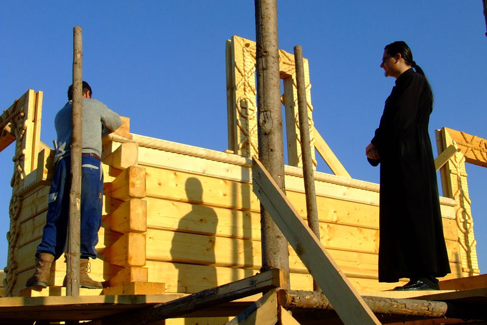

# ISTORIC

Biserica din lemn, cu hramul _„Izvorul Tămăduirii”_ a fost ridicată între anii 2006- 2012, dar începuturile ei coboară până în secolul al XIX-lea, în vremea Sfântului Ierarh Andrei Şaguna şi în vremea arhipăstoririi Mitropolitului Nicolae Bălan; deoarece aceşti mari şi vrednici ierarhi ai Bisericii Ortodoxe Române şi-au exprimat doriţa ca să existe în staţiunea Covasna, un loc de închinare ortodox românesc.

În anul 2004, la doi ani de la absolvirea Facultății de Teologie Ortodoxă din București, Preotul Irimia Cristian Vlad originar din oraşul Covasna, împreună cu Episcopul Ioan Selejan, d-nul Condrea Ioan, familia Matei şi Kornelia Schinteie şi d-na Chirculescu Maria au început căutările, pentru aflarea unui loc adecvat pentru ridicarea viitoarei biserici.

Din iniţiativa Preasfinţitului Ioan în anul 2006, din fondurile Episcopiei, s-a cumpărat terenul de lângă Hotelul Montana pentru viitoarea biserică.

Prin Decizia chiriarhală nr. 476/ 2006 a Preasfinţitului Ioan, Episcopul Covasnei şi Harghitei, s-a înfiinţat noua Parohie Covasna Staţiune şi a fost numit administrator al acesteia Preotul Irimia Cristian Vlad, căruia i s-a încredinţat ridicarea sfântului locaş.

Pe 12 noiembrie 2006, în Duminica _„Samarineanului milostiv”_, s-a sfinţit locul şi s-a aşezat piatra de temelie a viitoarei biserici ce va purta hramul _„Izvorul Tămăduirii”_, în stațiunea _„celor 1000 de izvoare”_ de către Preasfinţitul Ioan, împreună cu un sobor de preoţi şi numeroşi credincioşi.

Ulterior s-a amenajat într-o veche stație de autobuz un paraclis, unde s-a început a se citi zilnic acatistele și paraclisele Maicii Domnului și ale Sfinților Părinţi.

Familia de arhitecți Apostol Virgil și Claudia, respectând dorința tatălui lor (d-nul Marin Mușter) au întocmit gratuit, proiectul viitoarei biserici.

Pe 27 martie 2007 s-a obţinut autorizaţia de construcţie a sfântului locaş.

În perioada 2007-2008, sub îndrumarea permanentă a Părintelui Episcop Ioan şi cu osteneala părintelui Irimia Cristian Vlad s-au executat lucrările de construcţii la biserică, avându-l ca șef de șantier pe d-nul Iusco Vasile, de la firma SC Euras din Satu-Mare.

În data de 13 aprilie 2007, la praznicul _„Izvorul Tămăduirii”_, s-a oficiat Sfântul Maslu şi s-a sfinţit troiţa de piatră din curtea bisericii.

Pe 22 februarie 2008, a avut loc sfinţirea Sfintei Cruci (cea de pe turnul bisericii) de PS Ioan, eveniment la care a participat Preşedintele României. Aşadar într-o zi de vineri când în Biserica Ortodoxă se cântă cu mare evlavie: _„O! De trei ori fericită şi preacinstită Cruce, ţie ne închinăm credincioşii şi te mărim, veselindu-ne de dumnezeiasca ta înălţare; ci ca o pavăză şi armă nebiruită, ocroteşte şi acoperă cu darul tău, pe cei ce strigă: Bucură-te, Cruce, păzitoarea creştinilor!”_ (Condacul 1, Acatistul Sf. Cruci) în staţiunea Covasna a avut loc sfinţirea şi înălţarea pe turnul Bisericii _„Izvorul Tămăduirii”_, Sfânta Cruce - _„semnul adevăratei bucurii”_.

Urmând sfinţilor îngeri care, _„din cer în chip nevăzut înconjoară cu frică Crucea cea de viaţă purtătoare şi, văzând-o că dă credincioşilor har de lumină dătător, cu strălucire, se spăimântează şi stau strigând către dânsa: Bucură-te, cea prin care se binecuvintează zidirea.”_ (Icosul 1, Acatistul Sf. Cruci) s-au asemănat şi Preacucernicul Preot Irimia Cristian Vlad, parohul Bisericii _„Izvorul Tămăduirii”_ din oraşul Covasna, alături de Preasfinţitul Părinte Ioan Selejan, Episcopul Covasnei şi Harghitei înconjuraţi de întreaga comunitate participantă la rugăciune.

Cu acest prilej Pr. Irimia Cristian Vlad a rostit memorabilele cuvinte: _„Importanţa copleşitoare a zilei de 22 februarie 2008 o dă chiar ridicarea Sfintei cruci deasupra Covasnei, căci _„ea(Crucea) este pentru noi, cei ce ne mântuim, puterea lui Dumnezeu”_. (1 Cor. 1,18) Totodată, uitându-ne la Sf. Cruce care, parcă este o cheie aşezată în poarta cerului, inimile noastre de români ortodocşi se înflărează cântând în cor: _„ Cu noi este Dumnezeu, înţelegeţi neamuri, şi vă plecaţi, căci cu noi este Dumnezeu./Auziţi până la marginile pământului, căci cu noi este Dumnezeu./Cei puternici, plecaţi-vă, căci cu noi este Dumnezeu./Şi orice sfat veţi sfătui, risipi-l-va Domnul, căci cu noi este Dumnezeu./De frica voastră nu ne vom teme, nici ne vom tulbura, căci cu noi este Dumnezeu/Pe Domnul Dumnezeul nostru, pe Acela vom sfinţi, şi El va fi nouă frică, căci cu noi este Dumnezeu.”_”_(cântare din Pavecerniţa Mare)

Pe 10 martie 2008, a avut loc sfinţirea clopotului, donat de familia Ruţă Moise şi Camelia.

În ziua de 10 martie 2008 în staţiunea Covasna pentru întâia dată la biserica ortodoxă _„Izvorul Tămăduirii”_ de lângă hotelul Montana, un _„înger”_(clopotul) care şi-a făcut casă în turnul bisericii a anunţat începerea Postului Mare. Cu prilejul slujbei de sfinţire a clopotului, Părintele Episcop Ioan a ţinut să le spună donatorilor clopotului, că acesta va plânge după ce ei vor trece pragul veşniciei, făcând pomenire de această bine primită jertfă a lor.

Înălţarea clopotului în turnul bisericii a reprezentat un moment important în viaţa credincioşilor ortodocşi din Covasna şi din întreaga ţară, pentru că el îi va chema cu sunetu-i cristalin la dumnezeieştile slujbe pe toţi, deopotrivă localnici şi creştini veniţi în staţiune pentru tămăduirea lor trupească şi sufletească. El nu numai că va anunţa momentele importante din viaţa liturgică a comunităţii credincioşilor dar, cu puterea care i-a fost conferită prin rugăciune, el va certa furtunile, va izgoni fulgerele şi va potoli cutremurele. Pentru cei care îi vor auzi glasul el este viu, căci sunetul său deschide conştiinţa şi sufletul omenesc tainic cu chemarea Domnului nostru Iisus Hristos: _„Veniţi la Mine toţi cei osteniţi şi împovăraţi şi Eu vă voi odihni pe voi.”_ Clopotul deasemeni, cât va dăinui va îndreapta privirile oamenilor spre cer, aducându-le aminte de Cel ce s-a înălţat de-a dreapta lui Dumnezeu Tatăl şi care la trâmbiţarea arhanghelului se va coborî pentru a judeca lumea.

Pe 20 aprilie 2008, de Florii s-a săvârşit pentru prima dată în biserică Sfânta Liturghie, slujbă săvârşită de Preotul Paroh Irimia Cristian Vlad.

Pe 3 mai 2008, s-a ţinut pentru întâia oară hramul Bisericii _„Izvorul Tămăduirii”_, la care a participat Preasfinţitul Ioan Selejan, preoţii din împrejurimi, precum şi mulţi credincioşi. În această zi binecuvântată de 3 mai 2008, oraşul Covasna a îmbrăcat haine de sărbătoare, căci s-a lăudat şi s-a cinstit cu cântări preafrumoase mama Bisericii Ortodoxe, Preasfânta Născătoare de Dumnezeu. Biserica de lemn construită în stilul vechi românesc ce poartă hramul _„Izvorul Tămăduirii”_, parcă şi-a desfăcut acoperişul pentru a-i lăsa pe credincioşi să zboare spre înălţimi; iar acest lucru a devenit posibil, datorită dumnezeieştii slujbe săvârşită de Preasfinţitul Ioan Episcopul Covasnei şi Harghitei. Simţirile lăuntrice ale celor prezenţi s-au tradus în cuvinte astfel: _„Un ritm, un tremur de vibraţii/Te-nalţă tot mai sus în nori;/E Duhul Sfânt în toţi chemaţii!/Nu-ţi pasă dacă ai să mori,/Vei fi etern ieşind din spaţii/Din timp şi din comori./Că e minune sau spectacol/În ochii vii, de forme plini,/Să înfloreşti ca un oracol,/Să-ţi curgă-n vine noul vin!/Ai vrea-ntr-un univers miracol/Să mori şi să te-nchini.”_ (Ilie Mocanu, _„Lumina nevăzută care se creează”_)

Preotul Paroh Irimia Cristian Vlad cu acest prilej a spus credincioşilor, că _„Domnul a pogorât din ceruri pe pământ ca să mântuiască pe cel pierdut (Matei 18,11), şi a întemeiat pe pământ Biserica Sa, pentru ca oricând să se mântuiască cei ce doresc mântuirea, pentru ca oricând să se vindece de bolile trupeşti şi sufleteşti, pentru ca oricând să se lumineze cei ce caută să se elibereze de întunericul păcatului, pentru a-i întări pe cei neputincioşi, pentru a-i lumina şi curăţa pe cei necuraţi, pentru a-i izbăvi de necazuri, nevoi şi de sărăcia sufletească…”_(citat din Sfântul Ioan din Kronştadt, _„Liturghia: Cerul pe Pământ”_)

Tot din cuvântul părintelui paroh s-au desprins câteva învăţături legate de Praznicul Izvorului Tămăduirii, care atrage atenţia asupra Sfintei Fecioare Maria, ce a arătat viitorului împărat Leon un izvor, care ieşea din pământul pe care ea l-a binecuvântat în acel loc. Cu această apă purtătoare de har, binecredinciosul Leon a vindecat un orb şi mai târziu a cinstit acel loc sfânt, cu ridicarea unei frumoase biserici.

De un asemenea izvor purtător de viaţă aveau nevoie şi covăsnenii, dar mai ales toţi creştinii care vin în staţiune pentru vindecarea diferitelor boli.

Gândindu-se la această nevoie a poporului lui Dumnezeu, Episcopul Ioan împreună cu Preotul Irimia Cristian Vlad au căutat precum odinioară împăratul Leon, un loc pentru zidirea unui sfânt altar, din care se va putea scoate ca dintr-o fântână, apa cea curăţitoare de patimi şi tămăduitoare de boli.

Ascultând glasul celei Grabnic Ajutătoare, s-a hotărât ca biserica ce izvorăşte har şi binecuvântare să fie construită ca şi cetăţile din vechime, pe un loc înalt şi anume pe platoul de lângă hotelul Montana. Din această poziţie ce tronează întregul oraş, Mângâietoarea celor necăjiţi şi întristaţi îşi va putea întinde mâinile peste toţi covăsnenii, păzindu-i cu omoforul ei de toată răutatea şi viclenia neîmpăcată a diavolului.

Bucuria prilejuită de ţinerea hramului a fost deplină, căci Preasfinţitul Ioan, Episcopul Covasnei şi Harghitei a împărtăşit harul ceresc rostind cuvintele _„Pace vouă”_, înconjurat de 12 preoţi, reînoind cele întâmplate imediat după Slăvita Înviere, când Domnul Iisus, Biruitorul morţii s-a arătat apostolilor şi Maicii Sale, zicându-le: _„Pace vouă. Îndrăzniţi şi vedeţi că Eu Însumi sunt.”_ La sfârşitul înălţătoarei slujbe, persoanele ce-au participat la Sfântul Maslu şi sfinţirea apei au cules rouă cerească, căci Părintele Episcop Ioan a plouat peste toţi izbăvitoarea aghiasmă.

În anul 2013, s-a realizat pictarea icoanelor catapetesmei bisericii, prin osteneala ctitorilor acestei lucrări deosebite - familia Schinteie Matei şi Kornelia, apoi biserica s-a împodobit cu un brâu de icoane ale sfinţilor şi prăznicare pictate de aceeaşi familie Schinteie din Covasna, pe cheltuiala credincioşilor binefăcători.

În prezenţa a sute de credinciosi, pe 4 noiembrie 2012 a avut loc sfintirea bisericii de lemn din Covasna, iar Preotul Paroh Irimia Cristian Vlad a fost hirotesit iconom. Slujba de sfintire a fost oficiata de IPS Arhiepiscop Ioan al Covasnei și Harghitei, care a rânduit ca biserica să aibă un al doilea hram - Schimbarea la Faţă a Domnului.

În anul 2014, au început lucrările la pictarea pereţilor şi a boltei bisericii în tehnica Al Secco de către o echipă de pictori conduși de d-nul Bălașa Dumitru.

Pe data de 29 noiembrie 2015 după săvârşirea Dumnezeieştii Liturghii, Preasfinţitul Părinte Andrei a săvârşit slujba de sfinţire a picturii bisericii, mărturisind astfel: _„Astăzi, îi dăm slavă lui Dumnezeu pentru că ne-a ajutat să ajungem această sfântă şi binecuvântată zi, în care rodul ostenelilor părintelui Cristian Vlad Irimia şi ale dumneavoastră a tuturor - această pictură minunată şi dumnezeiască a primit putere sfinţitoare.”_ Pentru lucrarea osârduitoare părintele Irimia Cristian Vlad, a fost învrednicit cu rangul de iconom stavrofor, în conformitate cu canoanele şi rânduielile administrative ale Bisericii.

Prin eforturile Preotului Irimia Cristian Vlad şi ale Preasfinţitului Andrei, Episcopul Covasnei şi Harghitei s-au obţinut fondurile necesare definitivării lucrărilor din interiorul demisolului bisericii, consacrat desfăşurării de activităţii misionar-pastorale comunitare.

**DUMNEZEU SĂ SCRIE ÎN CARTEA VIEȚII ȘI SĂ UMPLE DE BUNĂTĂȚILE SALE PE CTITORII ȘI BINEFĂCĂTORII SFÂNTULUI LOCAȘ.**
